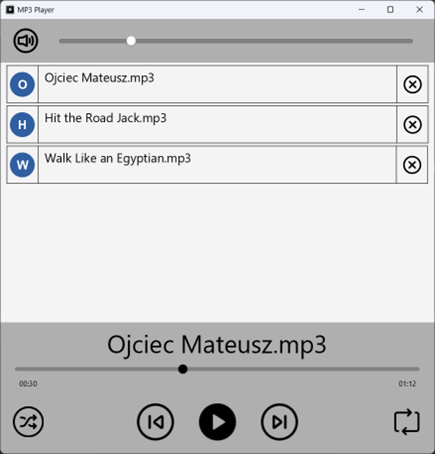

# MusicPlayer-JavaFX

Aplikacja desktopowa do odtwarzania muzyki zbudowana w oparciu o JavaFX.  
Umożliwia wygodne zarządzanie listą utworów oraz ich odtwarzanie z wieloma funkcjami dostosowanymi do potrzeb użytkownika.  
Intuicyjny interfejs pozwala na łatwą obsługę wszystkich opcji programu.

---

## Funkcjonalność

- **Zmiana głośności**  
  Regulacja głośności dźwięku za pomocą suwaka oraz możliwość całkowitego wyciszenia przez naciśnięcie przycisku głośnika.

- **Odtwarzanie listy w losowej kolejności**  
  Przycisk umożliwiający odtwarzanie utworów w przypadkowej kolejności. W normalnym trybie utwory są odtwarzane po kolei.

- **Zmiana piosenki**  
  Przycisk "Następna" odtwarza kolejny utwór, a "Poprzednia" poprzedni utwór z listy. Przycisk "Zatrzymaj/Wznów" pozwala na zatrzymanie oraz wznowienie odtwarzania.

- **Odtwarzanie w pętli**  
  Funkcja pętli umożliwia nieprzerwane odtwarzanie utworów.

- **Zmiana momentu odtwarzania**  
  Suwak pozwala na wybranie konkretnego miejsca w utworze, od którego ma rozpocząć się odtwarzanie.

- **Lista utworów**  
  Dodawanie utworów przez przeciągnięcie pliku na ekran aplikacji. Możliwość zmiany kolejności utworów poprzez przeciąganie na liście. Lista oraz jej kolejność są zapamiętywane pomiędzy uruchomieniami programu.

---

## Zrzut ekranu

---
